# 🧶 Manual de Usuario — Wooly Wonder

**Versión 1.4.0**

Wooly Wonder es una aplicación de escritorio que convierte cualquier fotografía o imagen en un **patrón cuadriculado** listo para tejer, bordar o hacer punto de cruz, crochet, jacquard o intarsia. Cada cuadrito de la cuadrícula equivale a un punto de tu labor.

<!-- CAPTURA PENDIENTE: vista general de la app (barra lateral, editor central y paleta) -->
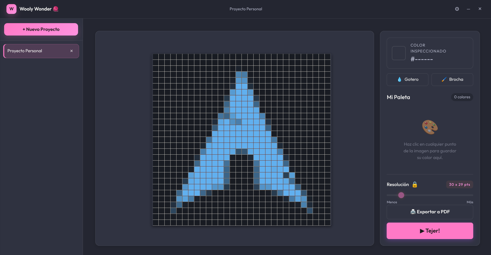
*Vista general: barra lateral de proyectos, editor central y paleta de colores.*

> 💡 Este manual describe cómo usar la aplicación. Es una guía de referencia; te recomendamos revisar cada sección la primera vez que uses una función.

---

## Índice

1. [Primeros pasos](#1-primeros-pasos)
2. [Proyectos: crear, abrir y eliminar](#2-proyectos-crear-abrir-y-eliminar)
3. [Agregar imágenes](#3-agregar-imágenes)
4. [El editor de patrones](#4-el-editor-de-patrones)
5. [Ajustar el nivel de detalle (Resolución)](#5-ajustar-el-nivel-de-detalle-resolución)
6. [Navegar por la imagen: zoom y desplazamiento](#6-navegar-por-la-imagen-zoom-y-desplazamiento)
7. [Recortar la imagen](#7-recortar-la-imagen)
8. [Crear tu paleta de colores](#8-crear-tu-paleta-de-colores)
9. [Herramientas: Gotero y Brocha](#9-herramientas-gotero-y-brocha)
10. [Modo Tejer](#10-modo-tejer-)
11. [Exportar a PDF](#11-exportar-a-pdf)
12. [Preferencias y personalización](#12-preferencias-y-personalización)
13. [Guardado automático](#13-guardado-automático)
14. [Atajos de teclado y ratón](#14-atajos-de-teclado-y-ratón)
15. [Preguntas frecuentes](#15-preguntas-frecuentes)

---

## 1. Primeros pasos

Al abrir Wooly Wonder verás tres zonas principales:

- **Barra lateral izquierda:** la lista de tus proyectos y el botón **+ Nuevo Proyecto**.
- **Zona central:** el área de trabajo, donde aparece tu imagen o el estado de bienvenida.
- **Cabecera superior:** el nombre de la app, el proyecto activo y los botones de **Ajustes (⚙)**, minimizar (—) y cerrar (✕).

Si es la primera vez que abres la aplicación, no tendrás proyectos. Crea uno para empezar.

---

## 2. Proyectos: crear, abrir y eliminar

Un **proyecto** es un contenedor donde guardas una o varias imágenes con sus patrones, paletas y progreso.

<!-- CAPTURA PENDIENTE: barra lateral con la lista de proyectos junto a la galería de imágenes del proyecto activo -->
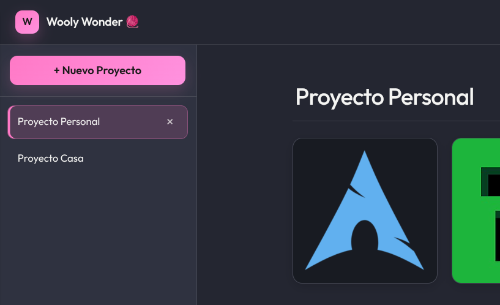
*La barra lateral muestra tus proyectos; la galería, las imágenes del proyecto activo.*

- **Crear un proyecto:** haz clic en **+ Nuevo Proyecto** en la barra lateral. Se creará con un nombre por defecto (por ejemplo, *"Nuevo Proyecto 1"*).
- **Cambiar el nombre:** abre el proyecto y edita el campo de texto del nombre en la parte superior de la galería. El cambio se guarda solo.
- **Abrir un proyecto:** haz clic sobre su nombre en la barra lateral.
- **Eliminar un proyecto:** pasa el ratón sobre el proyecto y pulsa la **×**. La aplicación te pedirá **confirmación** antes de borrarlo, para que no pierdas tu trabajo por accidente.

> En pantallas pequeñas (móvil), usa el botón flotante **⋮** de la esquina inferior para crear proyectos.

---

## 3. Agregar imágenes

Dentro de un proyecto hay una **galería**. Para añadir una imagen tienes tres formas:

1. **Hacer clic** en el recuadro punteado **"Cargar imagen"** y elegir un archivo de tu computadora.
2. **Arrastrar y soltar** una imagen sobre ese recuadro.
3. **Pegar con `Ctrl + V`** una imagen que tengas en el portapapeles.

Puedes cargar **varias imágenes a la vez**. Cada imagen del proyecto tendrá su propio patrón y su propia paleta.

**Pegado inteligente (`Ctrl + V`):**

- Si **no tienes ningún proyecto**, la app crea uno automáticamente y pega ahí la imagen.
- Si tienes **un proyecto abierto**, la imagen se añade a ese proyecto.
- Si tienes **varios proyectos** pero ninguno abierto, la app te preguntará **en cuál quieres guardar** la imagen pegada.

<!-- CAPTURA PENDIENTE: diálogo "¿Dónde quieres guardar la imagen pegada?" con varios proyectos listados -->
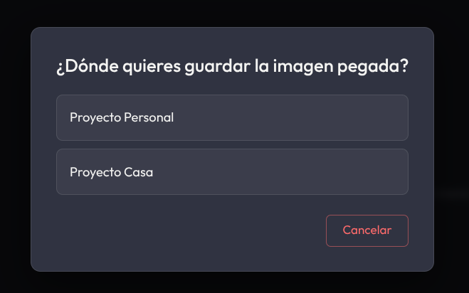
*Al pegar con Ctrl+V teniendo varios proyectos, la app pregunta dónde guardar la imagen.*

**Eliminar una imagen:** en la galería, pulsa la **×** sobre la miniatura. Se te pedirá confirmación.

Para abrir una imagen y empezar a trabajar en su patrón, haz clic sobre su miniatura.

---

## 4. El editor de patrones

Al abrir una imagen entras en el **editor**. La imagen aparece automáticamente pixelada, es decir, dividida en una cuadrícula donde **cada cuadrito es un punto de tu tejido**.

<!-- CAPTURA PENDIENTE: el editor con la imagen pixelada, el inspector de color, la paleta y el control de resolución -->
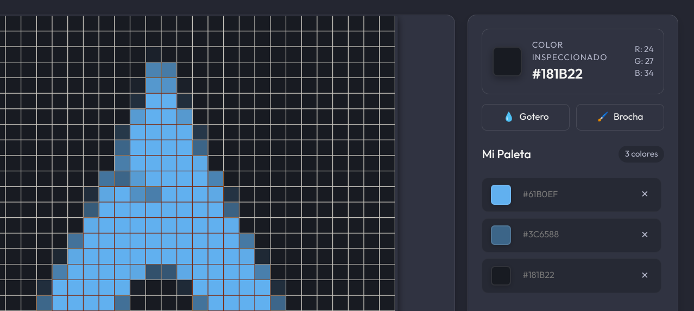
*Editor: lienzo con la cuadrícula a la izquierda; inspector de color, paleta y controles a la derecha.*

La cuadrícula es **inteligente**: sus líneas y números cambian de color para contrastar siempre con la foto (claros sobre zonas oscuras, oscuros sobre zonas claras), de modo que nunca fuerces la vista al contar puntos.

En el editor encontrarás:

- **A la izquierda:** el lienzo con tu patrón.
- **A la derecha (barra lateral):** el **Color Inspeccionado**, las herramientas, tu **Paleta**, el control de **Resolución** y los botones **Exportar a PDF** y **Tejer!**.

Para volver a la galería del proyecto, usa el enlace **← Volver a [nombre del proyecto]** en la parte superior.

---

## 5. Ajustar el nivel de detalle (Resolución)

El control **Resolución** (barra deslizante en la parte inferior derecha) decide cuántos cuadritos tendrá tu patrón:

- **Hacia "Menos":** menos cuadritos → patrón más grande, rápido y fácil de tejer.
- **Hacia "Más":** más cuadritos → diseño más detallado y realista, pero con más puntos.

Junto al control verás las dimensiones actuales, por ejemplo `22 x 22 pts` (puntos de ancho por alto).

**Candado de resolución (🔓 / 🔒):**
Pulsa el candado para **bloquear** la resolución actual. Con el candado cerrado (🔒) la barra queda desactivada, para que no cambies el nivel de detalle por accidente mientras trabajas.

<!-- CAPTURA PENDIENTE: primer plano del control "Resolución" mostrando el slider, las dimensiones (ej. 22 x 22 pts) y el candado 🔓/🔒 -->
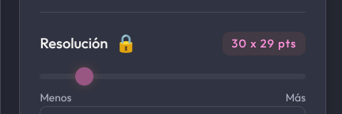
*El control de resolución con las dimensiones y el candado para bloquear el nivel de detalle.*

> ⚠️ Cambiar la resolución **reinicia** los píxeles que hayas pintado a mano con la Brocha (ver sección 9), porque la cuadrícula se recalcula. Ajusta primero la resolución y pinta después.

---

## 6. Navegar por la imagen: zoom y desplazamiento

- **Acercar / alejar (zoom):** gira la **rueda del ratón** sobre la imagen. El zoom se centra en el punto donde apuntas.
- **Desplazar (mover la imagen):** mantén **presionada la rueda del ratón** (botón central) y arrastra.
- **En pantallas táctiles:** pellizca con dos dedos para hacer zoom; arrastra con un dedo (en Modo Concentración) para desplazarte.

Esto te permite acercarte todo lo que necesites para no perder la cuenta de los puntos.

---

## 7. Recortar la imagen

Cuando **haces zoom** sobre la imagen (más allá del tamaño normal), aparece el botón **✂️ Recortar** en la esquina superior derecha del lienzo.

Al pulsarlo, la imagen se **reemplaza por el área que ves actualmente** en pantalla. Es útil para quedarte solo con una parte de la foto.

<!-- CAPTURA PENDIENTE: imagen con zoom aplicado mostrando el botón "✂️ Recortar" arriba a la derecha del lienzo -->
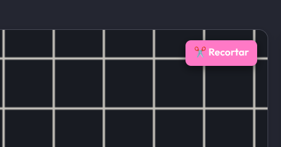
*Al hacer zoom aparece el botón ✂️ Recortar para quedarte con el área visible.*

> ⚠️ El recorte **no se puede deshacer**. La app te pedirá confirmación antes de aplicarlo.

---

## 8. Crear tu paleta de colores

La **paleta** es tu lista de los colores de lana o hilo que necesitarás.

1. **Pasa el ratón** por encima de la imagen. El recuadro **Color Inspeccionado** (arriba a la derecha) te muestra el color exacto bajo el cursor, con su código HEX y sus valores R, G y B.
2. Cuando encuentres un color que quieras usar, **haz clic izquierdo** sobre ese cuadrito. El color se guarda en **Mi Paleta**.
3. **Ponle un nombre** a cada color escribiendo en su campo de texto (por ejemplo, *"Lana Roja"* o *"Algodón Cielo"*). Así sabrás qué comprar.
4. Para **borrar un color** de la paleta, pulsa la **✕** junto a él.

El contador junto a "Mi Paleta" te indica cuántos colores llevas guardados.

---

## 9. Herramientas: Gotero y Brocha

En la barra lateral, sobre la paleta, tienes dos herramientas para **editar el patrón a mano**:

<!-- CAPTURA PENDIENTE: barra lateral mostrando los botones "💧 Gotero" y "🖌️ Brocha", con el selector de color de la brocha visible -->
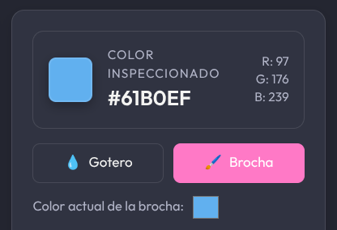
*Las herramientas Gotero y Brocha, con el selector de color de la brocha activo.*

### 💧 Gotero
Activa el Gotero y haz clic en cualquier cuadrito de la imagen para **copiar su color**. Ese color pasa automáticamente a la Brocha, listo para pintar.

### 🖌️ Brocha
Activa la Brocha para **pintar cuadritos** con el color que elijas:

- Elige el color con el **selector de color** que aparece junto a la herramienta, o cópialo con el Gotero.
- Haz clic (o mantén pulsado y arrastra) sobre los cuadritos para pintarlos.
- **Deshacer:** `Ctrl + Z`
- **Rehacer:** `Ctrl + Shift + Z`

Sirve para corregir zonas, simplificar detalles o ajustar el diseño a los hilos que tienes.

> ⚠️ Recuerda: cambiar la **Resolución** borra los píxeles pintados a mano. Pinta cuando ya tengas fijado el nivel de detalle (puedes usar el candado 🔒 para asegurarlo).

---

## 10. Modo Tejer ▶

Es la herramienta estrella para **seguir tu patrón fila por fila**.

**Para empezar:** pulsa el botón **▶ Tejer!**. La app te preguntará **desde dónde quieres empezar**:

- **Arriba:** comienzas por la primera fila (arriba de la imagen).
- **Abajo:** comienzas por la última fila (abajo de la imagen).

<!-- CAPTURA PENDIENTE: diálogo "¿Desde dónde quieres empezar?" con los botones Arriba / Abajo -->
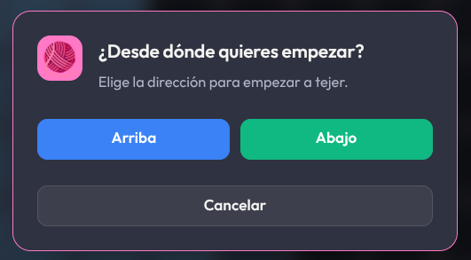
*Antes de tejer, eliges si empiezas por arriba o por abajo del patrón.*

Al elegir, entras automáticamente en **Modo Concentración** (se ocultan los menús) y el editor cambia:

<!-- CAPTURA PENDIENTE: Modo Tejer con la fila actual resaltada, el resto atenuado y las columnas numeradas -->
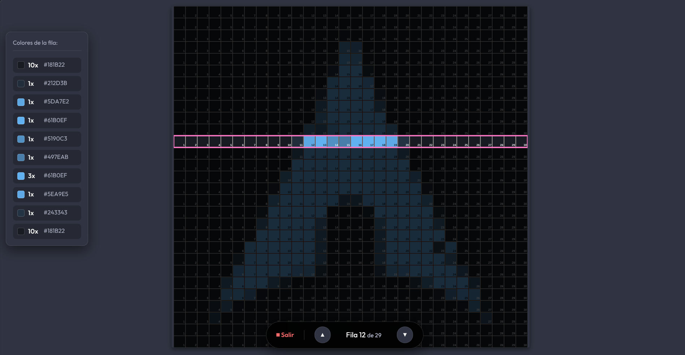
*Modo Tejer: la fila actual se resalta, el resto se atenúa y cada columna se enumera.*

- **Solo se resalta la fila actual**; el resto de la imagen se atenúa para que no te distraigas.
- **Cada columna se enumera** (1, 2, 3…) para que sepas exactamente cuántos puntos tejer.
- Aparece un **contador de fila** ("Fila 7 de 22") con botones **▲ / ▼** para avanzar o retroceder de fila.

### Panel "Colores de la fila"
Muestra la secuencia de colores de la fila que estás tejiendo, agrupados por tramos. Por ejemplo, `12x Lana Roja` significa "teje 12 puntos rojos seguidos". Además:

- **Un clic** en un tramo lo **resalta en verde** sobre el patrón, para ubicarlo fácilmente.
- **Doble clic** en un tramo lo marca como **completado** (se atenúa y se tacha sobre el patrón). Vuelve a hacer doble clic para desmarcarlo.
- Puedes **acercar/alejar este panel** con dos dedos (pantallas táctiles) si necesitas verlo más grande.

### Marcar tu punto actual
**Haz clic sobre cualquier cuadrito** de la fila para colocar un **punto rojo** que marca dónde te quedaste. Haz clic de nuevo sobre él para quitarlo.

### Salir del Modo Tejer
Pulsa **⏹ Salir** (arriba) o la tecla **`Esc`**.

> 💾 Tu progreso en el Modo Tejer —fila actual, tramos completados y punto marcado— **se guarda automáticamente**. Si cierras la app, todo seguirá donde lo dejaste.

---

## 11. Exportar a PDF

Pulsa **🖨️ Exportar a PDF** para generar un documento imprimible con dos páginas:

1. **Página 1 — El patrón:** la cuadrícula completa con el nombre de tu proyecto.
2. **Página 2 — La paleta:** la lista de colores guardados con sus nombres o códigos HEX.

<!-- CAPTURA PENDIENTE: el PDF exportado mostrando el patrón (página 1) y la paleta de colores (página 2) -->
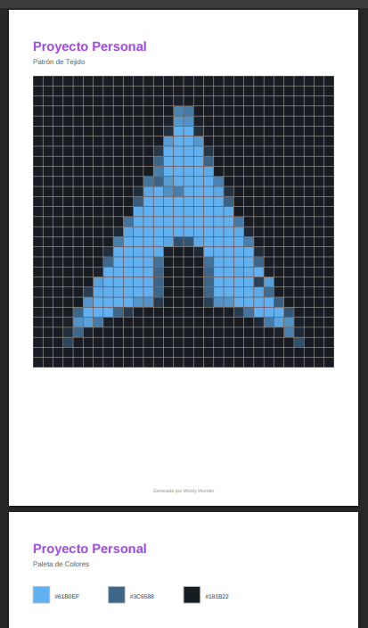
*El PDF incluye el patrón y, en una segunda página, la lista de colores de la paleta.*

El archivo se guarda con el nombre de tu proyecto (por ejemplo, `proyecto_minecraft.pdf`) y verás un aviso de confirmación cuando esté listo. Ideal para tejer sin depender de la pantalla o para compartir tu patrón.

---

## 12. Preferencias y personalización

Abre **Ajustes (⚙)** en la cabecera. Las secciones son:

<!-- CAPTURA PENDIENTE: diálogo de Ajustes abierto en la sección "Tema", mostrando las opciones de temas y el tema personalizado -->
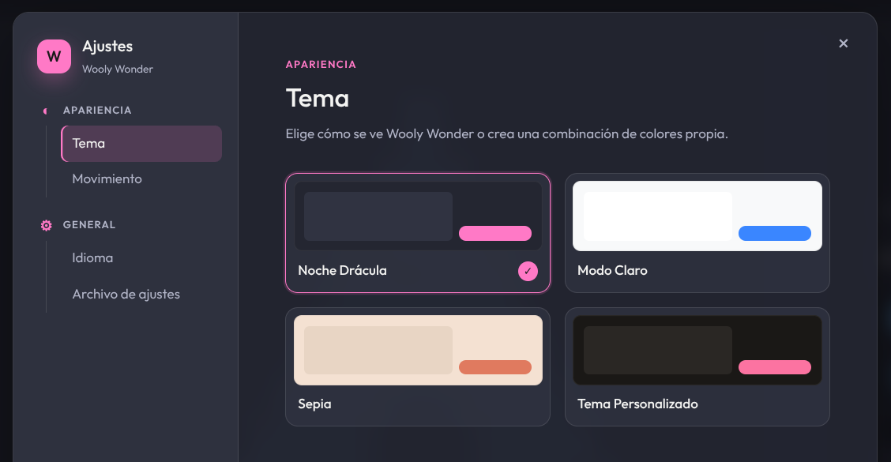
*El panel de Ajustes permite cambiar el tema, el movimiento y el idioma.*

### 🎨 Tema
Elige la apariencia de la aplicación:

- **Noche Drácula** (oscuro, por defecto)
- **Modo Claro** (claro y azul)
- **Sepia** (tonos cálidos)
- **Tema Personalizado:** crea tu propia combinación eligiendo los colores de **Fondo**, **Paneles**, **Texto** y **Acento**. Los cambios se aplican y guardan al instante.

### 🎞️ Movimiento
Controla cuántas animaciones usa la interfaz:

- **Completo:** transiciones y efectos expresivos.
- **Sutil:** movimiento breve y discreto (por defecto).
- **Desactivado:** sin animaciones. Útil si prefieres una interfaz más estática o tienes sensibilidad al movimiento.

### 🌐 Idioma
Cambia entre **Español** e **Inglés** para toda la aplicación.

### 📄 Archivo de ajustes
Todas tus preferencias se guardan en un único archivo `settings.json`. Puedes pulsar **Abrir carpeta** para localizarlo y **compartirlo** con otra persona o equipo: basta con reemplazar allí su `settings.json` y reiniciar la aplicación.

---

## 13. Guardado automático

Wooly Wonder **guarda todo automáticamente**: proyectos, imágenes, paletas, nombres de colores, nivel de detalle, píxeles pintados a mano y tu progreso del Modo Tejer. No hay un botón de "Guardar" — cuando vuelvas a abrir la aplicación, todo estará exactamente donde lo dejaste.

---

## 14. Atajos de teclado y ratón

| Acción | Cómo |
|---|---|
| Pegar una imagen | `Ctrl + V` |
| Deshacer (Brocha) | `Ctrl + Z` |
| Rehacer (Brocha) | `Ctrl + Shift + Z` |
| Salir del Modo Tejer / Concentración | `Esc` |
| Zoom sobre la imagen | Rueda del ratón |
| Desplazar la imagen | Mantener presionada la rueda del ratón + arrastrar |
| Guardar un color en la paleta | Clic izquierdo sobre un cuadrito |
| Marcar tu punto (Modo Tejer) | Clic izquierdo sobre un cuadrito de la fila |
| Resaltar un tramo de color (Modo Tejer) | Un clic en el panel "Colores de la fila" |
| Marcar tramo como completado (Modo Tejer) | Doble clic en el panel "Colores de la fila" |

---

## 15. Preguntas frecuentes

**¿Se borran mis proyectos si cierro la aplicación?**
No. Todo se guarda automáticamente y estará intacto la próxima vez que abras la app.

**Me cuesta ver las líneas de la cuadrícula en fotos muy oscuras o muy claras.**
No te preocupes: la cuadrícula y los números ajustan su color automáticamente para contrastar siempre con la imagen.

**Pinté con la Brocha y al mover la resolución se borró todo.**
Es normal: al cambiar el nivel de detalle la cuadrícula se recalcula desde cero. Fija primero la resolución (puedes bloquearla con el candado 🔒) y pinta después.

**¿Puedo tener varias imágenes en un mismo proyecto?**
Sí. Cada proyecto es una galería con varias imágenes, y cada imagen guarda su propio patrón, paleta y progreso.

**¿Cómo comparto mi patrón con alguien?**
Exporta a PDF (sección 11). Obtendrás el patrón y la lista de colores en un documento imprimible.

---

*Hecho con mucho amor para la comunidad tejedora.* 💜
